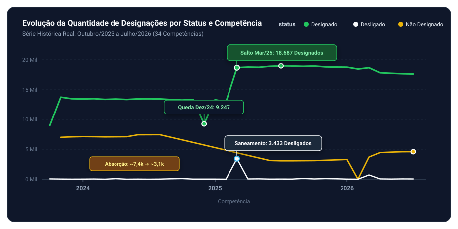
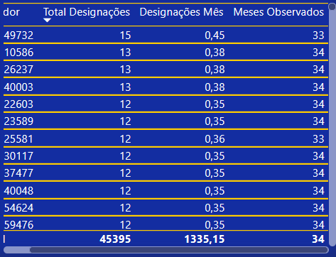
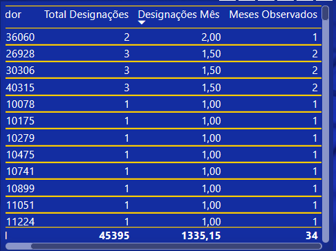

# 📊 Insights do Dashboard — Acompanhamento PGD / INSS

Este documento traz uma análise prática dos dados históricos de designações do Programa de Gestão e Desempenho (PGD) do INSS, cobrindo de **outubro/2023 a janeiro/2026**.

> 💡 **Nota rápida sobre as análises:**  
> Tudo o que está descrito aqui são **interpretações e hipóteses** baseadas no que os números mostram no painel. Como não participamos diretamente das decisões internas de gestão, não dá para cravar nada com 100% de certeza. Encare essas análises como pistas e suposições para ajudar a entender o cenário e trocar uma ideia com quem toca o programa no dia a dia.

---

## 📌 Resumo Rápido (O que os dados parecem nos dizer)

Olhando para a base histórica completa no dashboard, dá para notar alguns comportamentos bem claros:

1. **O programa parece ter dado um salto em 2025:** Em 2024, a quantidade de servidores com plano ativo ficou bem estável (~13 mil a 14 mil). A partir do início de 2025, os números subiram de forma contínua para a casa dos **18 mil a 19 mil**. A impressão é de que o programa passou a cobrir mais gente.
2. **Queda forte nos "Não Designados":** No começo de 2024, tínhamos cerca de 8,5 mil registros de servidores sem plano cadastrado. Ao longo do tempo esse número foi caindo até bater em torno de **2 mil a 3 mil em 2025**. Tudo indica que boa parte dessa turma foi formalizada no PGD.
3. **Aquele pico atípico em março/2025:** Quase 3,5 mil desligamentos em um único mês chamam muita atenção. A suposição mais provável é que o pessoal fez uma "limpeza" cadastral em lote no sistema para encerrar planos antigos e abrir os novos logo em seguida, e não que houve perda de servidores no órgão.
4. **Virada de ano costuma ter transição:** No início de 2026, os designados caem um pouco (~17 mil) e os não designados sobem (~4,5 mil). É bem provável que isso seja apenas o encerramento natural de vigências anuais e o tempo que a burocracia leva para formalizar os novos planos.
5. **Auditoria fica mais tempo, CEAB1 concentra o volume:** Quem atua em governança e auditoria tem planos que duram muito mais dias (talvez por lidar com metas mais longas). Já a CEAB1 reúne a imensa maioria dos registros, sugerindo foco prioritário na análise remota de benefícios.

---

# 🔎 Insight 1 — Evolução por Competência: O que rolou ao longo do tempo?

O gráfico de linha **"Evolução da Quantidade de Designações por Status e Competência"** acompanha o comportamento das três categorias: **Designado**, **Não Designado** e **Desligado**.

| Período | Designados (Verde) | Não Designados (Amarelo) | Desligados (Branco) | O que pode explicar esse movimento? (Hipóteses) |
| :--- | :--- | :--- | :--- | :--- |
| **2024 (Ritmo Constante)** | Estável entre **13.264 e 13.494** (cai em dez/24 para **9.247**) | Fica em torno de **7k a 7,4k** | Quase nada (~12 a 110) | O programa funcionou em ritmo regular. A queda em dezembro provavelmente foi por conta de recesso e fechamento anual de planos. |
| **Março/2025 (Virada de Chave)** | Salto rápido para **18.687** | Queda acelerada nos registros | **Pico histórico de 3.433** | Provável encerramento em lote de planos legados para migrar todo mundo de uma vez para novas regras. |
| **2025 (Novo Patamar)** | Mantém-se alto entre **18.687 e 18.994** | Mínimas de **3.063 a 3.116** | Residual (~15 a 128) | O novo volume se consolidou, sugerindo que mais servidores passaram a atuar formalmente no PGD. |
| **2026 (Transição de Ano)** | Sustentado entre **17.624 e 18.770** | Sobe aos poucos até **4.592** | Baixo (~19 a 711) | Padrão condizente com vencimento de contratos anuais e o intervalo necessário para assinar os novos. |

### 1. Linha Verde (Designados): Estabilidade em 2024, Queda Sazonal e Salto em 2025

- **Em 2024:** A curva quase não se mexe durante o ano todo, mantendo-se firme na faixa de **13,2 mil a 13,5 mil servidores ativos**.
- **A queda de Dezembro de 2024:** Em dez/24 cai pontualmente para **9.247**, mas logo em janeiro já se recupera (13.313). A explicação mais óbvia é o encerramento em massa de planos antes do recesso de fim de ano, aguardando renovação em janeiro.
- **O salto de Março de 2025:** Em mar/25 o número pula direto para **18.687**, atingindo a máxima histórica de **18.994 em julho de 2025**. Tudo indica que o PGD ampliou seu alcance de forma sustentada a partir daí.

### 2. Linha Amarela (Não Designados): Mais gente entrando no programa

- **Em 2024:** Durante todo o ano, havia entre **7.000 e 7.400 servidores** sem plano ativo registrado.
- **Queda forte em 2025:** Junto com o salto dos designados, os não designados desabam para a faixa de **3.000 a 3.100** (queda de mais de 50%). A suposição mais provável é que boa parte dessa galera foi pactuada formalmente.
- **Volta a subir em 2026:** Ao longo de 2026 nota-se uma subida gradual (chegando a 4.592 em julho). Provavelmente é o efeito de planos vencendo e aguardando a assinatura de um novo termo.

### 3. Linha Branca (Desligados): Aquele pico curioso em Março de 2025

- **Comportamento normal:** Na esmagadora maioria dos meses, os desligamentos são mínimos (entre 12 e 120 casos).
- **O pico de Março de 2025 (3.433 casos):** Aconteceu uma concentração gigante e pontual. Como no mesmíssimo mês as novas designações deram um salto de mais de 5 mil registros, tudo aponta para uma rotina no sistema que "baixou" os planos antigos em lote para dar entrada nos novos. Dificilmente se tratou de gente saindo do INSS.
- **Repique em Março de 2026 (711 casos):** Exatamente um ano depois, ocorre outro pico menor, o que reforça a ideia de que março costuma ser um mês padrão de fechamento de ciclos anuais.

---

# ⏱️ Insight 2 — Quanto tempo duram as designações em cada área?

O indicador de **Média de Tempo (Dia) de Designação** calcula a duração média em dias entre a data de início e término dos planos cadastrados no sistema.

### Onde os planos duram mais (Governança e Auditoria)

Os maiores prazos médios de permanência aparecem em áreas de controle e assessoria:
- `PG-ACS` (Assessoria de Comunicação);
- `PG-CORREG` (Corregedoria-Geral);
- `PGRP` (Regime Parcial);
- `CEAP` (Central de Alta Performance);
- `PGD-GABPRE` (Gabinete da Presidência);
- `PG-AUDGER` (Auditoria-Geral).

**O que pode explicar isso? (Duas boas hipóteses):**  
1. Essas áreas cuidam de fiscalização, processos disciplinares e governança — atividades contínuas que costumam ter metas com prazos bem mais longos (talvez anuais ou semestrais).
2. Outra possibilidade é que o pessoal dessas áreas demore mais tempo para encerrar e dar baixa formal no plano dentro do sistema, deixando o registro aberto por mais dias.

### E nas áreas operacionais (CEAB1 e agências)?

Por outro lado, em setores como a **CEAB1** e no atendimento, os tempos médios são bem menores. Isso sugere que a rotatividade de planos é maior, provavelmente para acompanhar metas mensais ou trimestrais de análise de requerimentos.

---

# 👤 Insight 3 — Olhando os Servidores: Total de Planos vs. Quantidade por Mês

Na tabela do dashboard podemos olhar a distribuição por duas óticas: quem acumulou mais planos no total (**Total de Designações**) e quem teve a maior taxa mensal (**Designações/Mês**).

Tudo isso respeita a **LGPD**, já que os servidores aparecem apenas com códigos anônimos.

---

### Visão 1: Quem mais teve planos ao longo do tempo (Consistência)

Ordenando pelo **Total de Designações**, vemos os servidores que participaram de forma mais contínua do PGD:

| Servidor (Código) | Total Designações | Designações / Mês | Meses Observados | O que o histórico sugere |
| :---: | :---: | :---: | :---: | :--- |
| **49732** | **15** | 0,45 | 33 | Servidor com mais registros na base; participação quase sem pausas. |
| **10586** | **13** | 0,38 | 34 | Esteve presente em todos os 34 meses do histórico. |
| **26237** | **13** | 0,38 | 34 | Frequência compatível com renovações trimestrais regulares. |
| **40003** | **13** | 0,38 | 34 | Presença constante ao longo de quase 3 anos. |
| **22603** | **12** | 0,35 | 34 | Grupo que participou de ponta a ponta na série. |
| **23589** | **12** | 0,35 | 34 | Média aproximada de uma nova pactuação a cada 2,8 meses. |
| **25581** | **12** | 0,36 | 33 | Alta regularidade na participação. |
| **30117 / 37477 / 40048 / 54624 / 59476** | **12** | 0,35 | 34 | Servidores com histórico bastante estável no programa. |

#### 📌 O que podemos supor aqui:
1. **O máximo registrado foi de 15 planos:** Em quase 3 anos (34 meses), ninguém acumulou quantidades absurdas de registros. O teto foi 15.
2. **Ciclo trimestral aparente:** Quem tem presença completa (34 meses) fica com taxas entre **0,35 e 0,38 designações/mês**. Isso dá uma média de uma pactuação a cada **2,6 a 2,8 meses**, o que bate certinho com a suposição de ciclos trimestrais de metas.
3. **Trabalho bem distribuído:** Os números não mostram concentração excessiva em poucos servidores, o que dá a entender que a distribuição de planos é ampla e equilibrada.

---

### Visão 2: Cuidado com a taxa mensal em janelas curtas!

Se invertermos a tabela e ordenarmos pela taxa de **Designações/Mês**, aparecem números altos que podem enganar se não forem analisados com cuidado:

| Servidor (Código) | Total Designações | Designações / Mês | Meses Observados | Diagnóstico (Por que ter cautela?) |
| :---: | :---: | :---: | :---: | :--- |
| **36060** | 2 | **2,00** | **1** | Maior taxa matemática, mas baseada em um único mês observado. |
| **26928** | 3 | **1,50** | **2** | Teve 3 planos em apenas 2 meses de registro. |
| **30306** | 3 | **1,50** | **2** | Provável transição pontual ou divisão de planos em período curto. |
| **40315** | 3 | **1,50** | **2** | Mesma situação de ajuste em janela curta. |
| **10078 / 10175 / 10279 / 10475** | 1 | **1,00** | **1** | Aparecem em apenas um mês; pode ser entrada recente ou tarefa avulsa. |
| **10741 / 10899 / 11051 / 11224** | 1 | **1,00** | **1** | Registros isolados que indicam participações pontuais. |

#### ⚠️ Atenção para não tirar conclusões precipitadas:
- **A pegadinha da média em pouco tempo:** O servidor `36060` aparece com uma taxa de **2,00 designações/mês** (quase cinco vezes maior que o servidor mais antigo, que tem 0,45). Só que ele só tem 1 mês de registro! Isso é puramente um efeito matemático da amostra curta, e não significa que ele trabalhe mais ou esteja sobrecarregado.
- **Sugestão prática:** Essa taxa por mês **não deve ser usada como métrica de produtividade**. O ideal é sempre cruzar a taxa com o tempo de casa do servidor (**Meses Observados $\ge 6$ ou $\ge 12$ meses**), separando ajustes rápidos de cadastro de quem tem uma atuação contínua no PGD.

---

### 📊 Números Gerais da Base

Para ter ideia do tamanho do conjunto de dados observado:
- **Total de registros acumulados:** **45.395** designações;
- **Série histórica coberta:** **34 meses** (de Outubro/2023 a Julho/2026).

---

# 🏢 Insight 4 — Onde está o maior volume e como varia no ano?

### A CEAB1 concentra a maior parte dos planos
No gráfico **"Designações por Programa"**, a **CEAB1** (Central de Análise de Benefício 1) se destaca com folga, ultrapassando **20 mil designações acumuladas**.
- Em seguida vêm as Superintendências Regionais (`SR_PGD`), `ATENDIMENTO` e `DIR_CENTRAL1`.
- Essa concentração levanta a forte suposição de que o grande foco do PGD seja mesmo a análise de processos de aposentadoria e pensão, ajudando a diminuir a fila de requerimentos.

### Como as coisas variam ao longo dos meses (Sazonalidade)
A média mensal de designações costuma girar entre **14 mil e 17 mil por mês**:
- **Picos em Março e Abril:** As médias mais altas ficam nesses dois meses (~16,7k a 17k), o que sugere um alinhamento com o fechamento do primeiro trimestre e renovação de planos.
- **Meio e fim de ano:** De maio em diante o ritmo se estabiliza em torno de 15k a 16k, com uma leve desaceleração em novembro antes dos fechamentos do ano.

---

# 💡 O que podemos concluir (Nossas principais hipóteses)

1. **A base histórica está consistente:** Não há buracos ou falhas no acompanhamento desde o fim de 2023.
2. **O PGD parece ter expandido perto de 40%:** Passou de cerca de 13,5k para quase 19k planos ativos entre 2024 e 2025, enquanto a quantidade de servidores sem plano caiu bastante.
3. **Março/2025 foi provavelmente uma virada cadastral:** Quase certamente os 3,4k desligamentos foram um encerramento em lote no sistema para abrir os novos planos da nova fase do programa, e não demissões.
4. **Respeito total à privacidade:** Toda a análise foi feita preservando o sigilo dos servidores com identificadores numéricos.

---

# 🎯 Perguntas para tirar a limpo com quem gerencia o PGD

Para saber se essas nossas suposições estão certas, vale a pena conversar com os gestores do programa e confirmar:

1. **O que causa a subida de não designados no começo do ano?** É apenas a espera natural para assinar os novos contratos ou tem servidores deixando o teletrabalho?
2. **O que rolou no sistema em março/2025?** Houve mesmo alguma rotina automática no Sisref que baixou os planos antigos em lote?
3. **Por que a Corregedoria e Auditoria têm prazos tão longos?** É pela natureza de longo prazo das metas ou o pessoal demora para encerrar os planos no sistema depois que eles terminam?
